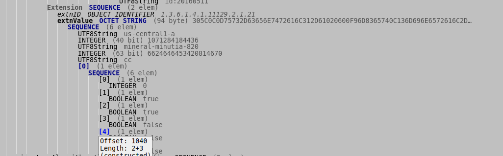

## Sealing RSA and Symmetric keys with GCP vTPMs

Sample applications that seal keys to [TPM](https://en.wikipedia.org/wiki/Trusted_Platform_Module) [Platform Configuration Registers (PCR)](https://link.springer.com/chapter/10.1007/978-1-4302-6584-9_12) values using Google [Confidential Compute](https://cloud.google.com/confidential-computing) instances

This repo demonstrates how a remote user can acquire a GCP VM's unique [Endorsement Public key](https://cloud.google.com/security/shielded-cloud/retrieving-endorsement-key) and then use that to seal/encrypt a key such that it can only get unsealed/decrypted _on that vm_.

In addition, the key is sealed using a PCR policy that mandates the key can only be unsealed or used if specific PCR values are present on that VM 
and if the VM gets deleted, the key cannot be unsealed.

There are two types of keys that are sealed and transferred
* Seals arbitrary symmetric key to a TPM
  An arbitrary key which can be a simple AES key or in the example below, just "hello world".  Just note, the arbitrary data is encrypted such that it can only be decrypted by that TPM.  It does not unseal the arbitrary data _into_ the target TPM.  The capability to embed a key into a TPM is not yet implemented in `go-tpm-tools` but it is covered under `tpm-tools` [Duplicate and Transfer](https://github.com/salrashid123/tpm2/tree/master/tpm2_duplicate)

* Seals RSA Private key to TPM
  An RSA private key that is sealed and embedded into the TPM.  Note: once an RSA key is imported, the TPM will only use it to sign data.
  The raw embedded key will not get exported outside of the TPM.   In this mode, the RSA key is unsealed _into_ the target TPM (eg, imported)

In the final step, we will alter/extend the PCR value we originally sealed data against.  This will prevent any further unsealing of the symmetric key as well as prevent import of the RSA key.  Furthermore, since we imported an RSA key with a different PCR value earlier, this will prevent using the TPM to sign  using that RSA key.


---

### Setup

```bash
$ tree
.
├── asymmetric
│   ├── import         // unseal an RSA Key on GCP
│   │   └── main.go
│   ├── seal           // Seal RSA key to a VMs ekPub
│   │   └── main.go
│   └── sign           // use TPM keyhandle to sign data
│       └── main.go
├── LICENSE
├── cert_parser        // parse the EKCertificate and extract the custom OID values
│   ├── go.mod
│   ├── go.sum
│   └── main.go
├── pcr_utils          // used to read and extend PCR values
│   ├── main.go
│   └── README.md
├── README.md
└── symmetric          // Seal/Unseal a symmetric key
    └── main.go
```


### Create Confidential Compute Instance

```bash
gcloud beta compute  instances create cc   --zone=us-central1-a \
 --machine-type=n2d-standard-2   --confidential-compute   --subnet=default \
 --network-tier=PREMIUM --maintenance-policy=TERMINATE  \
 --no-service-account --no-scopes --image-family=ubuntu-2204-lts  \
 --image-project=confidential-vm-images
```

[install golang](https://golang.org/doc/install)

```bash
gcloud compute ssh cc
sudo su -
apt-get update
wet https://go.dev/dl/go1.20.2.linux-amd64.tar.gz
rm -rf /usr/local/go && tar -C /usr/local -xzf go1.20.2.linux-amd64.tar.gz
export PATH=$PATH:/usr/local/go/bin
```


### Acquire and Verify EKCert

- On laptop, acquire Endorsement Certificate and Public key

```bash
# get public key
gcloud compute instances get-shielded-identity cc --format="value(encryptionKey.ekPub)" > /tmp/ek.pem

# get x509 and remove trailing extra line gcloud adds
gcloud compute instances get-shielded-identity cc --format="value(encryptionKey.ekCert)" | awk '/^$/{n=n RS}; /./{printf "%s",n; n=""; print}' -  > /tmp/ekcert.pem
openssl x509 -in /tmp/ekcert.pem -text -noout

# optionally extract rsa pubic key from cert and compare; this will be the same as /tmp/ek.pem
openssl x509 -pubkey -noout -in /tmp/ekcert.pem
```

Note the certificate extensions and issuers

```
        X509v3 extensions:
            X509v3 Basic Constraints: critical
                CA:FALSE
            X509v3 Authority Key Identifier: 
                67:08:C4:77:11:FD:D5:87:84:D3:2C:1D:6B:4D:97:83:60:84:25:80
            Authority Information Access: 
                CA Issuers - URI:https://pki.goog/cloud_integrity/tpm_ek_intermediate_3.crt
            X509v3 CRL Distribution Points: 
                Full Name:
                  URI:https://pki.goog/cloud_integrity/tpm_ek_intermediate_3.crl
            X509v3 Key Usage: critical
                Key Encipherment
            X509v3 Extended Key Usage: 
                2.23.133.8.1
            X509v3 Subject Directory Attributes: 
                0.0...g....1.0...2.0.......
            X509v3 Subject Alternative Name: critical
                DirName:/2.23.133.2.1=id:474F4F47/2.23.133.2.2=vTPM/2.23.133.2.3=id:20160511
            1.3.6.1.4.1.11129.2.1.21: 
```

* `X509v3 Extended Key Usage`

  `2.23.133.8.1` is the OID [tcg-kp-EKCertificate](https://oid-rep.orange-labs.fr/get/2.23.133.8.1)
  from [TCG specification](https://trustedcomputinggroup.org/wp-content/uploads/IWG_Platform_Certificate_Profile_v1p1_r15_pubrev.pdf) (line 960)

* `Authority Information Access`

  to verify the chain:

```bash
  wget https://pki.goog/cloud_integrity/tpm_ek_intermediate_3.crt
  openssl x509 -in tpm_ek_intermediate_3.crt -text -noout
  wget https://pki.goog/cloud_integrity/tpm_ek_root_1.crt
   
  # to pem
  openssl x509 -inform der -in tpm_ek_intermediate_3.crt -outform pem -out tpm_ek_intermediate_3.pem
  openssl x509 -inform der -in tpm_ek_root_1.crt -outform pem -out tpm_ek_root_1.pem

  openssl verify -show_chain -verbose -CAfile <(cat tpm_ek_intermediate_3.pem tpm_ek_root_1.pem) /tmp/ekcert.pem
      /tmp/ekcert.pem: OK
      Chain:
      depth=0:  (untrusted)
      depth=1: C = US, ST = California, L = Mountain View, O = Google LLC, OU = Cloud, CN = "tpm_ek_v1_cloud_host-signer-0-2021-10-12T04:22:11-07:00 K:1, 3:nbvaGZFLcuc:0:18"
      depth=2: C = US, ST = California, L = Mountain View, O = Google LLC, OU = Cloud, CN = "tpm_ek_v1_cloud_host_root-signer-0-2018-04-06T10:58:26-07:00 K:1, 1:Pw003HsFYO4:0:18"
```

* `X509v3 Subject Alternative Name`

  These are OIDs for the TPM itself:

  * [2.23.133.2.1](http://oid-info.com/get/2.23.133.2.1): `tcg-at-tpmManufacturer`   `hex(474F4F47)` which is `GOOG`
  * [2.23.133.2.2](http://oid-info.com/get/2.23.133.2.2): `tcg-at-tpmModel`  which is `vTPM`
  * [2.23.133.2.3](http://oid-info.com/get/2.23.133.2.3): `tcg-at-tpmVersion` which is `FirmwareVersion: id:20160511`

  That just tells us that this certificate was part of a Google TPM (see [TCG TPM Vendor ID Registry ](https://trustedcomputinggroup.org/wp-content/uploads/TCG-TPM-VendorIDRegistry-v1p06-r0p91-pub.pdf))


* *`X509v3 Subject Directory Attributes`

  is actually `OID 2.23.133.2.16:   tcg-at-tpmSpecification`  which you can see in the asn1 parser output below.  The values denotes the TPM level (`TPM 2.0`)  
                    
* `1.3.6.1.4.1.11129.2.1.21` 

  is a custom OID that isn't registered and openssl won't show its details
  so lets look at it using an [asn1 parser](https://lapo.it/asn1js/#MIIFKjCCBBKgAwIBAgITAQnwBLCO4yfOu6lm5l/DEGabKjANBgkqhkiG9w0BAQsFADCBuTELMAkGA1UEBhMCVVMxEzARBgNVBAgTCkNhbGlmb3JuaWExFjAUBgNVBAcTDU1vdW50YWluIFZpZXcxEzARBgNVBAoTCkdvb2dsZSBMTEMxDjAMBgNVBAsTBUNsb3VkMVgwVgYDVQQDDE90cG1fZWtfdjFfY2xvdWRfaG9zdC1zaWduZXItMC0yMDIxLTEwLTEyVDA0OjIyOjExLTA3OjAwIEs6MSwgMzpuYnZhR1pGTGN1YzowOjE4MCAXDTIzMDMyNTE5NDE1NVoYDzIwNTMwMzE3MTk0NjU1WjAAMIIBIjANBgkqhkiG9w0BAQEFAAOCAQ8AMIIBCgKCAQEA3sls5I5cRxko9uGC5cI2tAjmhJEswn/zN91DUkmeCenGLLeT2Y33rNzMCuROHaTjxmzy6Y1Zeh3xrVtF7+NTtIywfc1xf6b0VxrV00IcWKyuH0NN7YEyvECkNePGFqB435xEFFjleEMESTD5rfSuNgLQYIZmkUwVe6AA/yP5wOzB6oy9o3f274ys9JkfidNWzWQyfl4rNOq+TQ8oxGLWN8rxMAom+wWtCc2d2oh4nHEVGNj2Q6ddvmtVGjCGpPqY+Ka9FyO7wG0/NHRVlAx/MVfJLUXz2V5zx01sldIg3fiV3jQTBtscHV+Cu6rvIssI4L5nwoOYkZYwA6BBKv16UQIDAQABo4IB3zCCAdswDAYDVR0TAQH/BAIwADAfBgNVHSMEGDAWgBRnCMR3Ef3Vh4TTLB1rTZeDYIQlgDBWBggrBgEFBQcBAQRKMEgwRgYIKwYBBQUHMAKGOmh0dHBzOi8vcGtpLmdvb2cvY2xvdWRfaW50ZWdyaXR5L3RwbV9la19pbnRlcm1lZGlhdGVfMy5jcnQwSwYDVR0fBEQwQjBAoD6gPIY6aHR0cHM6Ly9wa2kuZ29vZy9jbG91ZF9pbnRlZ3JpdHkvdHBtX2VrX2ludGVybWVkaWF0ZV8zLmNybDAOBgNVHQ8BAf8EBAMCBSAwEAYDVR0lBAkwBwYFZ4EFCAEwIgYDVR0JBBswGTAXBgVngQUCEDEOMAwMAzIuMAIBAAICAI4wUQYDVR0RAQH/BEcwRaRDMEExFjAUBgVngQUCAQwLaWQ6NDc0RjRGNDcxDzANBgVngQUCAgwEdlRQTTEWMBQGBWeBBQIDDAtpZDoyMDE2MDUxMTBsBgorBgEEAdZ5AgEVBF4wXAwNdXMtY2VudHJhbDEtYQIGAPltg2V0DBNtaW5lcmFsLW1pbnV0aWEtODIwAghb73jZurLxTgwCY2OgIDAeoAMCAQChAwEB/6IDAQH/owMBAQCkAwEBAKUDAQEAMA0GCSqGSIb3DQEBCwUAA4IBAQC2HjGGZmsmkyRQX+vjsOtFX2SVV7rpBbhZFDW8E0Tmc/iSmYhMTao1mBjmfI03Ux1ITEiaqRv/bUv0wzFCIfvptAG49E3lvPmtsGj3sATAAk8m+xRlxa60DYEdE7MfrMbCZpoaTpFfgf9eMOe1WfJwhw0U8skKnzpAVsvqIWIFQGW8MuIghlpf/RaLtF60getuom97pMPRDVrcB2XWLNn+DPzQNprfzMv+zLCJtubiZ8P9KZphdPEIdRU2X2iKMezwn6LFjDYtFLewPmAHX07wBheK72X74NLgJwc8PZYAKOsB9RfDdqwGKAH+NMSu5mAOzf5SeaRJ5MwAmlOcok7y)





  That shows some interesting stuff:

```text
          extnID OBJECT IDENTIFIER 1.3.6.1.4.1.11129.2.1.21
          extnValue OCTET STRING (94 byte) 305C0C0D75732D63656E7472616C312D61020600F96D8365740C136D696E6572616C2D…
            SEQUENCE (6 elem)
              UTF8String us-central1-a
              INTEGER (40 bit) 1071284184436
              UTF8String mineral-minutia-820
              INTEGER (63 bit) 6624646453420814670
              UTF8String cc
```


  Remember we created an instance called `cc` ...that seems to be right there in encoded form as the extension...and you're right; Google EK certs encodes the `instanceName`, `instanceID`, `projectName` and `projectNumber` _into the cert_....


  The encoding allows you to verify that "this specific instance on GCP in this project and zone signed some data with its vTPM"

  To parse this in golang

```bash
cd cert_parser/
$ go run main.go 
  2023/03/25 16:29:28 InstanceID: 6624646453420814670
  2023/03/25 16:29:28 InstanceName: cc
  2023/03/25 16:29:28 ProjectId: mineral-minutia-820
  2023/03/25 16:29:28 ProjectNumber: 1071284184436
  2023/03/25 16:29:28 Zone: us-central1-a
```

### Sealed Symmetric Key


- On `cc` VM we create, extend PCR value for `PCR=23`

```bash
gcloud compute ssh cc
sudo su -
git clone https://github.com/salrashid123/gcp_tpm_sealed_keys.git
```

- Print the default value:

```bash
go run pcr_utils/main.go --mode=read --pcr=23 -v 10 -alsologtostderr

    I1006 16:05:32.472993    2758 main.go:66] ======= Print PCR  ========
    I1006 16:05:32.474946    2758 main.go:71] PCR(23) 0000000000000000000000000000000000000000000000000000000000000000
```

- Increment the PCR so we have non-default value (we just do this step for demonstration)

```bash
go run pcr_utils/main.go --mode=extend --pcr=23 -v 10 -alsologtostderr
    I1006 16:06:55.159899    2812 main.go:74] ======= Extend PCR  ========
    I1006 16:06:55.161682    2812 main.go:79] Current PCR(23) 0000000000000000000000000000000000000000000000000000000000000000
    I1006 16:06:55.164941    2812 main.go:92] New PCR(23) f5a5fd42d16a20302798ef6ed309979b43003d2320d9f0e8ea9831a92759fb4
```

- On laptop, seal key data to PCR=23 with value `f5a5fd42d16a20302798ef6ed309979b43003d2320d9f0e8ea9831a92759fb4`

```bash
go run symmetric/main.go  --mode=seal \
   --secret "hello world" \
   --ekPubFile=/tmp/ek.pem \
   --pcrValues=23=f5a5fd42d16a20302798ef6ed309979b43003d2320d9f0e8ea9831a92759fb4b   \
   --sealedDataFile=sealed.dat --logtostderr=1 -v 10
  
    I1006 12:52:27.056727  903568 main.go:65] PCR key: 23
    I1006 12:52:27.057173  903568 main.go:98] Sealed data to file.. sealed.dat
```

- Copy `sealed.dat` to VM (eg, `/tmp/sealed.dat`)

- on VM, unseal 

```bash
$ go run symmetric/main.go --mode=unseal --sealedDataFile=/tmp/sealed.dat --logtostderr=1 -v 10
    I1006 16:54:56.647861    3714 main.go:145] Unsealed secret: hello world
```

### Sealed Asymmetric Key

- On laptop, generate RSA key
```bash
openssl genrsa -out /tmp/key.pem 2048
```

- On laptop, seal RSA key and create test signature

Note, we are using the new PCR value from the previous section `f5a5fd42d16a20302798ef6ed309979b43003d2320d9f0e8ea9831a92759fb4b`
```bash

$ go run asymmetric/seal/main.go   \
     --rsaKeyFile=/tmp/key.pem  \
     --sealedOutput=sealed.dat  \
     --ekPubFile=/tmp/ek.pem \
     --pcrValues=23=f5a5fd42d16a20302798ef6ed309979b43003d2320d9f0e8ea9831a92759fb4b \
      --v=10 -alsologtostderr

    I1006 13:18:43.204890  908867 main.go:65] PCR key: 23
    I1006 13:18:43.205066  908867 main.go:81] ======= Init createSigningKeyImportBlob ========
    I1006 13:18:43.205077  908867 main.go:83] ======= Loading ekPub ========
    I1006 13:18:43.205136  908867 main.go:99] ======= Loading Service Account RSA Key ========
    I1006 13:18:43.205236  908867 main.go:113] ======= Generating Test Signature ========
    I1006 13:18:43.207006  908867 main.go:126] Signature: H4pl1iLxjuKN7n1tHsu1V5Bh/xeL/HaqvS4K6hPChBaczXuw76SVK6usBYJAYuRhdPN7jUkj/UIbw16Leo42b2o2N9pphME103iJGx+4m4OSW1rMAlPu9D7PWWH77kVNRN2/9tWDMexpVDsMChgGoTXh3X4XZ+Igt1zmTDW9kKZAG3Lkhi7FVuJ4whsT1xSC1xmHsJrhH9aKCnmJxd6poUVN4LOLcCPt5zktwOMLdx9qjGgXXxjeGLUq50SgrzMgxELFE/tgRhscycYCMZr1MvHUq1zcCF+xu8wHTMczqyDISg/k9A39an9BWG7nCUQ1tuuHEnEfgQ3GhPwchVFjDw==
    I1006 13:18:43.207019  908867 main.go:128] ======= CreateSigningKeyImportBlob for RSA Key: ========
    I1006 13:18:43.207171  908867 main.go:140] ======= Saving sealedkey ========
    I1006 13:18:43.207262  908867 main.go:150] Sealed data to file.. sealed.dat
```

- Copy sealed.dat to VM

- on VM import RSA Key

Specify the PCR value to use while creating test signature

```bash

$ go run asymmetric/import/main.go   --importSigningKeyFile=/tmp/sealed.dat \
  --keyHandleOutputFile=key.dat   --bindPCRValue=23 \
  --flush=all   --v=2 -alsologtostderr

    I1006 17:20:29.310822    4131 main.go:51] ======= Init importSigningKey ========
    I1006 17:20:29.397259    4131 main.go:73] Handle 0x3000000 flushed
    I1006 17:20:29.400073    4131 main.go:79] ======= Print PCR  ========
    I1006 17:20:29.401936    4131 main.go:84] Using PCR: %!i(int=23) f5a5fd42d16a20302798ef6ed309979b43003d2320d9f0e8ea9831a92759fb4b
    I1006 17:20:29.401973    4131 main.go:86] ======= Loading EndorsementKeyRSA ========
    I1006 17:20:29.407012    4131 main.go:93] ======= Loading sealedkey ========
    I1006 17:20:29.407212    4131 main.go:104] ======= Loading ImportSigningKey ========
    I1006 17:20:29.445478    4131 main.go:136] ======= Signing Data with Key Handle ========
    I1006 17:20:29.453321    4131 main.go:181] Test Signature: H4pl1iLxjuKN7n1tHsu1V5Bh/xeL/HaqvS4K6hPChBaczXuw76SVK6usBYJAYuRhdPN7jUkj/UIbw16Leo42b2o2N9pphME103iJGx+4m4OSW1rMAlPu9D7PWWH77kVNRN2/9tWDMexpVDsMChgGoTXh3X4XZ+Igt1zmTDW9kKZAG3Lkhi7FVuJ4whsT1xSC1xmHsJrhH9aKCnmJxd6poUVN4LOLcCPt5zktwOMLdx9qjGgXXxjeGLUq50SgrzMgxELFE/tgRhscycYCMZr1MvHUq1zcCF+xu8wHTMczqyDISg/k9A39an9BWG7nCUQ1tuuHEnEfgQ3GhPwchVFjDw==
```

Note, the Test signature generated locally compared to what was on the TPM after unsealing is the same.


### Alter PCR value

- On VM

```bash
$ go run pcr_utils/main.go --mode=extend --pcr=23 -v 10 -alsologtostderr
    I1006 17:24:04.232798    4260 main.go:73] ======= Extend PCR  ========
    I1006 17:24:04.234695    4260 main.go:78] Current PCR(23) f5a5fd42d16a20302798ef6ed309979b43003d2320d9f0e8ea9831a92759fb4b
    I1006 17:24:04.238030    4260 main.go:91] New PCR(23) db56114e00fdd4c1f85c892bf35ac9a89289aaecb1ebd0a96cde606a748b5d71
```

- Attempt to decrypt symmetric  `sealed.dat`

```bash
$ go run symmetric/main.go --mode=unseal --sealedDataFile=sealed.dat --logtostderr=1 -v 10
    I1006 17:25:15.127342    4319 main.go:145] Unsealed secret: 
    F1006 17:25:15.127396    4319 main.go:147] Unable to Import sealed data: unseal failed: session 1, error code 0x1d : a policy check failed
```

- Attempt to import asymmetric `sealed.dat`

```bash
$ go run asymmetric/import/main.go   --importSigningKeyFile=sealed.dat \
  --keyHandleOutputFile=key.dat   --bindPCRValue=23 \
  --flush=all   --v=2 -alsologtostderr
    I1006 17:26:23.885236    4380 main.go:51] ======= Init importSigningKey ========
    I1006 17:26:23.898508    4380 main.go:73] Handle 0x3000000 flushed
    I1006 17:26:23.901770    4380 main.go:79] ======= Print PCR  ========
    I1006 17:26:23.903833    4380 main.go:84] Using PCR: %!i(int=23) db56114e00fdd4c1f85c892bf35ac9a89289aaecb1ebd0a96cde606a748b5d71
    I1006 17:26:23.903873    4380 main.go:86] ======= Loading EndorsementKeyRSA ========
    I1006 17:26:23.909236    4380 main.go:93] ======= Loading sealedkey ========
    I1006 17:26:23.909402    4380 main.go:104] ======= Loading ImportSigningKey ========
    I1006 17:26:23.948927    4380 main.go:136] ======= Signing Data with Key Handle ========
    F1006 17:26:23.953802    4380 main.go:168] google: Unable to Sign with TPM: session 1, error code 0x1d : a policy check failed
```

- Attempt to embedded RSA Keyhandle `key.dat` that we loaded earlier bound to the previous PCR value (`f5a5fd42d16a20302798ef6ed309979b43003d2320d9f0e8ea9831a92759fb4b` )

  This will fail since we updated the value of PCR23.

```bash
$ go run main.go   --keyFile=key.dat   --bindPCRValue=23     --v=2 -alsologtostderr
    I1006 17:48:30.389303    5038 main.go:34] ======= Init  ========
    I1006 17:48:30.401942    5038 main.go:61] 0 handles flushed
    I1006 17:48:30.408789    5038 main.go:75] ======= Signing Data with Key Handle ========
    F1006 17:48:30.413426    5038 main.go:107] google: Unable to Sign with TPM: session 1, error code 0x1d : a policy check failed
```

#### Appendix

- [Duplicate and Transfer](https://github.com/salrashid123/tpm2/tree/master/tpm2_duplicate)
- [Trusted Platform Module (TPM) recipes with tpm2_tools and go-tpm](https://github.com/salrashid123/tpm2)
